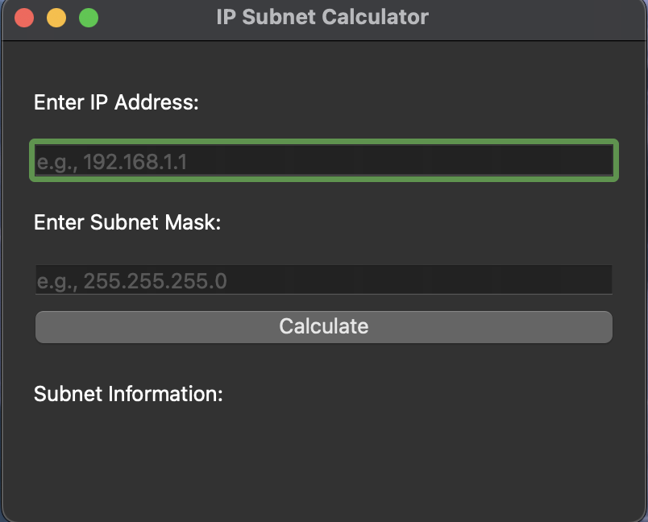
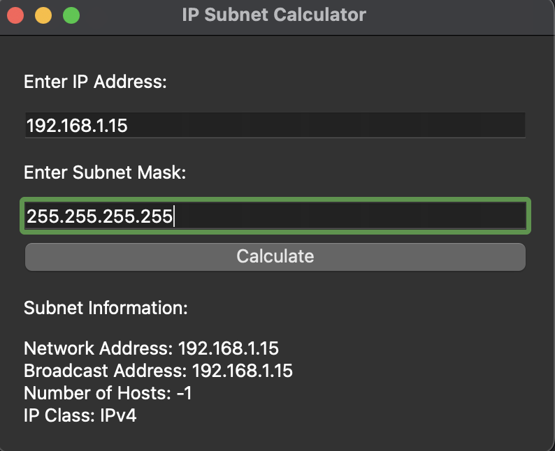

# IP Subnet Calculator

A simple PyQt6-based IP Subnet Calculator with a basic GUI that allows users to input an IP address and subnet mask. It also includes features to display the network address, broadcast address, the number of hosts, and the IP class.

## Features

- Input fields for IP address and subnet mask.
- Calculate button to determine subnet information.
- Display of network address, broadcast address, number of hosts, and IP class.

## Screenshots







## Usage

1. Enter the IP address and subnet mask in the respective input fields.
2. Click the "Calculate" button to get subnet information.

## Getting Started

### Prerequisites

- Python 3.x
- PyQt6 library
- Git
- Pip


### Installation

1. Clone the repository:

    ```bash
    git clone https://github.com/Alibakhshov/IP-Subnet-calculator.git
    ```

2. Install the required libraries:

    ```bash
    pip install -r requirements.txt
    ```

3. Run the application:

    ```bash
    python main.py
    ```

## Contributing

Contributions are welcome! If you have any suggestions or find a bug, feel free to open an issue or create a pull request.

## License

This project is licensed under the MIT License - see the [LICENSE](LICENSE) file for details.
